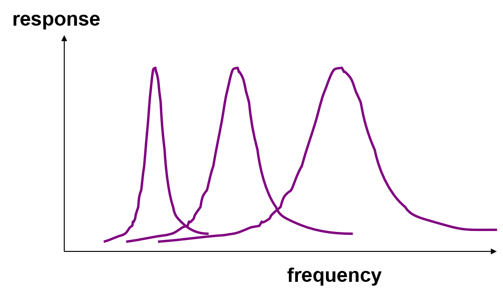
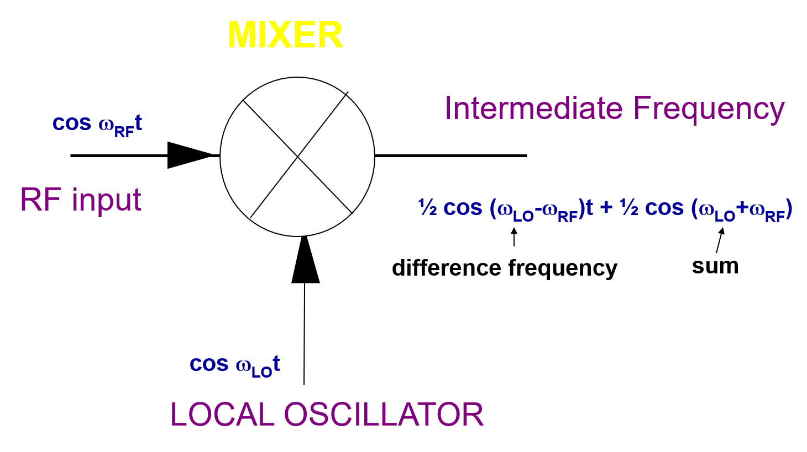
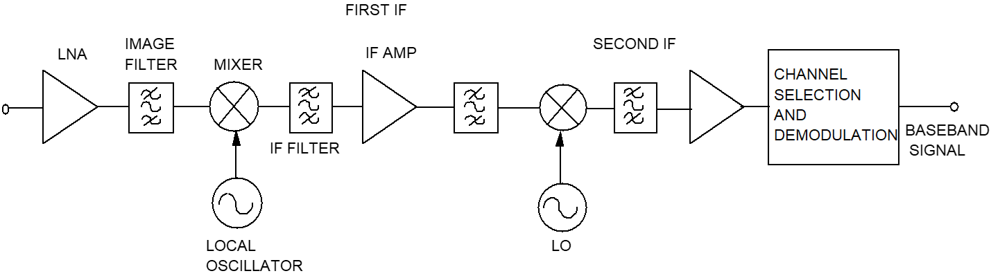
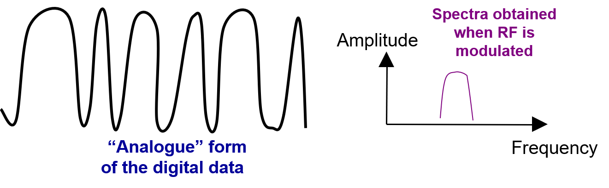
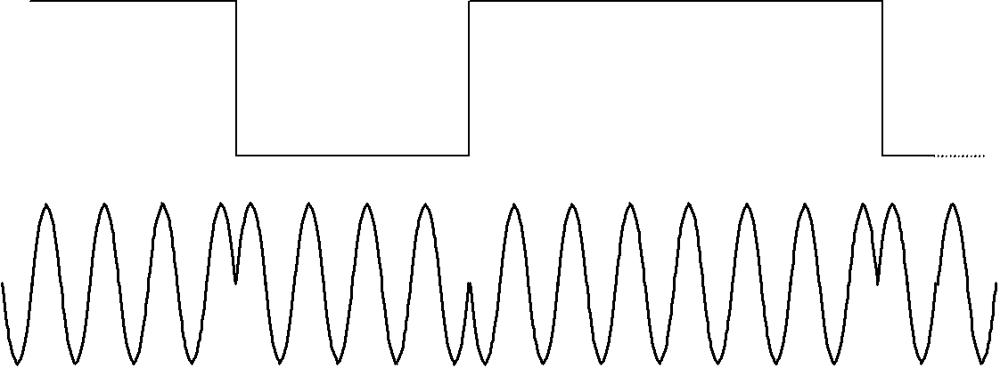
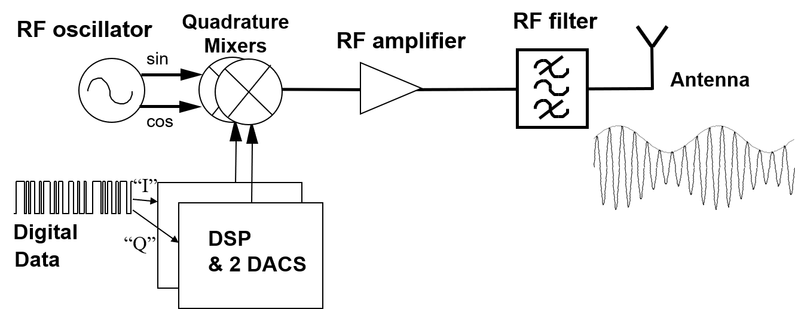
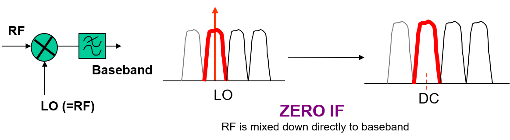
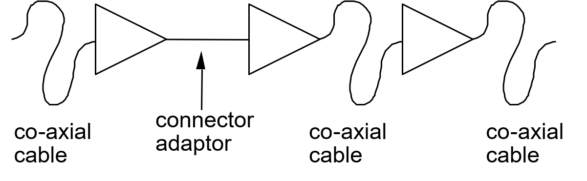
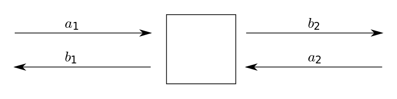
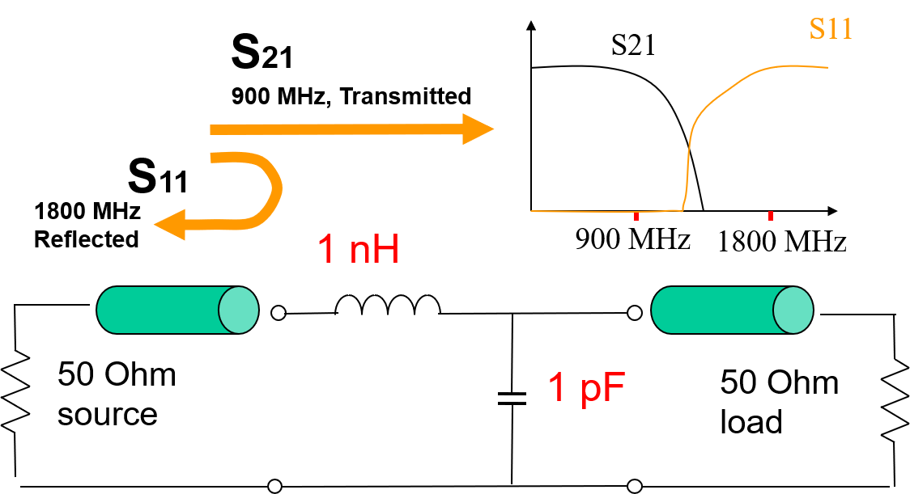

# 
XJEL/ELEC2140 Learning Tracking

## 
Yanshan Xie 201199596 2017110397

### 
Timestamp: April 12th, 2020

You can receive latest update here: [XJEL2140 Learning Tracking](./XJEL2140_Contents.html)

As the Lecture Captures are my major learning material right now, following table are filled.

| Source / Materials | Current Progress | Feedback & Note |
|:-|:-|:-|:-|
| Lecture Captures (Videos host on Mediasite) |OO_Mobile Phone and RFIC | **No nonplus so far** |
| Lecture Slides | *In sync with lecture captures* | **No nonplus so far** |
| ADS Screencast Tutorials for CAD Sheets | Cad2p1 | **No nonplus so far** |
| PowerPoint Screencasts of the Lectures (in Learning Resources) | 8_Reflections, Standing Waves, Transmission Line Resonators | The Screencasts are not compulsory, and some contents are covered in Lecture Captures. ***Planned for Revision.*** |
| Lab | ***<u>Not started yet</u>*** | ***<u>Not pragmatic now</u>*** |

## Detailed Progress
### Lecture Captures (Videos host on Mediasite)
- [x] [AA_Introduction - applications](#1)
- [x] [BB_Lab summary](#2)
- [x] [CC_Transmitters-Receivers Part1](#3)
- [x] [DD_Transmitters-Receivers Part2 (image etc)](#4)
- [x] [EE_Filters Part 1 50ohms & Intro](#5)
- [x] FF_Filters Part 2 Poles & Zeros, Butterworth/Chebyshev
- [x] GG_Lumped element filter design method
- [x] HH_Parasitics of lumped elements
- [x] II_Introduction to transmission lines
- [x] IX_Reflections and Transmission Line Resonators
- [x] JJ_Microstrip
- [x] KK_Amplifiers Part 1 - Matching and stability
- [x] LL_Amplifiers part2 - Noise and Distortion
- [x] MM_Transmission Line Theory
- [x] MN_Impedance transformation along a line and the Smith Chart
- [x] MO_LAST LECTURE_Impedance transformation along a line
- [x] NN_Satellite TV receiver
- [x] OO_Mobile Phone and RFIC
- [ ] PP_Measurements
- [ ] ZA_FIRST YEAR CIRCUITS REVISION
- [ ] ZB_FIRST YEAR COMMS REVISION

### PowerPoint Screencasts of the Lectures (in Learning Resources)

- [x] 1_Satellite TV and LNBs.mp4
- [x] 2_SMITH CHART PROGRAMME DEMO.wmv
- [x] 3_TheBigFilterMovie.wmv
- [x] 3_filtermoviemp4_720p.mp4
- [x] 4_Transmitters and receivers part1 EvenBiggerReceiversMovie.mp4
- [x] 5_Image problem and digital multiplexes.mp4
- [x] 6_Parasitics in Ls and Cs.mp4
- [x] 7_Transmission line types.mp4
- [x] 8_Reflections, Standing Waves, Transmission Line Resonators.mp4
- [ ] 9_Amplifier design video.mp4
- [ ] 10_Transmission Line Resonators - filters.mp4
- [ ] 11_Transmission line theory & standing waves.mp4
- [ ] 12_TRL_parameters.mp4
- [ ] 13_Digital communications I and Q in transceivers.mp4

***

&nbsp;  
&nbsp;  
<h2 id="1"></h2>

# Note of *Introduction*
> ### *Relevent Materials:*
> 1d_Intro_done.ppt  
> AA_Introduction - applications

Worksheets x 3
* RF Circuit Design & Simulation

Examples x 2
* Mobile Phone
* Satelite TV

Labs x 3
* Filters & Resonators
* Receivers
* Transmission Lines

## Antenna
- Dishes
- Terrestrial (UHF)
- Sector
- Radar
  - Pulsed Radar &rArr; Distance
  - Doppler Radar &rArr; Speed!
- Adaptive Phased Array (Electronically Steered)
  - Beam Forming Network
  - &rArr; Virtual Phased Array (Synthetic Aperture) &nbsp; **Using Motion**

## Antenna Gain
Omnidirectional = *isotropic*

To steer the wave, use *bulb & parabollic reflector*

The Unit:

dBi

> `i` refers to *isotropic*  
> $$G(dBi)=10 \log (\eta \frac{\pi^2 D^2}{\lambda^2})$$

&nbsp;  
&nbsp;  
<h2 id="2"></h2>

# Note of *Lab Summary*

> ### *Relevent Materials:*
> 2_Lab_intro.pptx  
> BB_Lab summary

## Lab
1. LCR Filters
2. LC Resonator & CAD1
3. Superheterodyne(***`adj. 超外差的`***) receiver
    * Mixing
    * Picking up weak signals (recover)
4. Pulses on long transmission lines
    > [!IMPORTANT]
    > Reflections
5. Transmission lines as resonators

> **Microwaves:**  
> Waves guided by metal conductors.  
> e.g. Coaxial cables; Hollow waveguides; Microstrips

## Keysight Agilent ADS
* Circuit simulations
  * Frequency domain linear analysis
  * S-parameters
* Microstrip circuit simulations
  * Multi layer boards
* Frequency domain nonlinear analysis
  * Mixing (Multiplying)
* Electromagnetic simulations
* System level analysis
  * MIMO
  * LTE
  
## Key to this module
1. Transmission Lines
2. Frequency Domain
3. S-Parameters
   

> Standard 50Ohms: Characteristic impedances of cables

&nbsp;  
&nbsp;  
<h2 id="3"></h2>

# Note of *Transmitters&Receivers Part 1*
> ### *Relevent Materials:*
> 5_radioTXRX_part1_done.ppt  
> CC_Transmitters-Receivers Part1

## Basic Digital Transmitter

## AM Radio Receiver (Demodulation)

## Sharpness (Selectivity)
depends on losses in the L and C, **Particularly RL**.  

To represent the selectivity, Q is introduced.  

$$Q_{factor}=\frac{Fr}{3dB BandWidth}$$  

Bandwitdh increases proportional to the frequency it is tuned to **squared**.  
(i.e. **BandWidth&uarr;; Q&darr;**)  

## Mixing
is the frequency **translation** to a low frequency for processing.

 > ## [Prosthaphaeresis 和差化积 (from the Greek προσθαφαίρεσις)](https://en.wikipedia.org/wiki/Prosthaphaeresis)  
 > $$ cosA \times cosB = \frac{1}{2} cos(A-B) + \frac{1}{2} cos(A+B)$$

Thus, in frequency domain, the frequency components are changed into:

## Superheterodyne Receiver

Terms:
 - LO : Local Oscillator
 - IF : Intermediate Frequency
 - RF : Radio Frequency
 - LNA : Low Noise Amplifier
 - AMP : Amplifier

Tunning/Changing Channel can be accomplished by tunning **the frequency of Local Oscillator**.

In order to achieve sharp frequency response, IF Filter is a bandpass filter that have **fixed** parameters.

**The LO must be very stable in frequency, and tune-able.**
Thus, some frequency sources introduced.

## SAW Devices (Surface Acoustic Wave)

## Also the Crystal Oscillator
Piezoelectric Material 压电材料  
Quartz 石英

## PLL (Phase Lock Loop)
The Oscillators above are very stable but relatively low frequency.
PLL can be used as **Clock Multipliers**.

> Phase Comparator  
> knows *almost instantly* when the frequency is drifting out.

Tune the frequency can be easily achieved by changing the factor of **digital divider**.

&nbsp;  
&nbsp;  
<h2 id="4"></h2>

# Note of *Transmitters&Receivers Part 2*
> ### *Relevent Materials:*
> 6_radioTXRX_part2_done.ppt  
> DD_Transmitters-Receivers Part2 (image etc)

## Image Problem

### Negative Frequency
Any signal at 88 MHz will also mix down to 1 MHz and pass through the IF filter.

To releviate the problem, a RF filter is introduced before the mixer (**Image Filter**).

## Double Conversion Receiver

## Key Points
  - Fractional Bandwidth (i.e. frequency&uarr;;Bandwidth&darr;)
  - Mixing : Sum and Difference frequencies
  - [Superheterodyne Diagram](#superheterodyne-receiver) & Operation
  - Tunning Local Oscillator (Quartz Reference) to select

## Digital Data Sidelobes
The sharp digital data need **infinite high frequency** to recover.

To limit the bandwidth, filters used.

- Still only interested in "1" or "0" level, so noise is rejected
- Sharp corners are rounded to limit the RF signal to a small bandwidth
- Filters, often use DSP chips

## Phase Modulation

Using the phase to represent "1" and "0" means the modulated signal uses less bandwidth for a certain data rate.

- Used in high quality digital links
- Less sensitive to noise
- Better *spectral efficiency* (bits/secend/Hz)
  
### Quaternary Phase Shift Keying (QPSK)
4 phases states: 0&deg; 90&deg; 180&deg; 270&deg;  

Transmitter used in phone system:

### 16-QAM (Quadrature Amplitude Modulation)
The Constellation (调制星座图):

## But Higher bits/symbol &Rarr; Lower resistance to noise!!!

## Software Radio
AD or DA chips can not directly placed at the antenna!
To be realistic, AD or DA are operating at Intermediate Frequency or Baseband.
This gives AD/DA conversion much **higher dynamic range** and much **less demanding specifications**

## Direct Conversion Architectures (homodyne 零差)
Carrier Frequency = Frequency of Local Oscillator (receiver)

Pros:
- Digital Circuits *directly applied* to baseband signals
- Lower component count and cost
- Flexibility
  - Different data rates; modulation schemes; services; future upgradation

Cons:
- Higher DC power

&nbsp;  
&nbsp;  
<h2 id="5"></h2>

# Note of *RF Filters Part 1*
> ### *Relevent Materials:*
> 8_FILTS_part1_50Ohms_done.ppt  
> Filters Part 1 50ohms & Intro

> ## A transducer for separating waves on the basis of their frequencies.

## Transmission Lines

- Low loss
- Shield
  - Preventing signal leaking
  - Rejecting electrical interference
- The signal is confined (***GUIDED***) by conductors  
- ## 
Waves

### eg: Coaxial Cable (同轴线缆)

## Impedance Match

Unless the amplifiers are matched to the characteristic impedance (**50 &Omega;**) of the cables and conntectors;

**Reflections** are created between components.

## S-Parameters
> [**Scattering parameters** or **S-parameters**](https://en.wikipedia.org/wiki/Scattering_parameters) (the elements of a scattering matrix or S-matrix) describe the electrical behavior of linear electrical networks when undergoing various steady state stimuli by electrical signals.  
> S-parameters are mostly used for networks operating at radio frequency (RF) and microwave frequencies where signal power and energy considerations are more easily quantified than currents and voltages.  
> An example: The S-parameter matrix for the 2-port network

>   
> $$\begin{pmatrix} b_1 \\ b_2 \end{pmatrix}\ = \begin{pmatrix} S_{11} & S_{12} \\ S_{21} & S_{22} \end{pmatrix}\ \begin{pmatrix} a_1 \\ a_2 \end{pmatrix}$$  
>   
> $$S_{11}$$ is the input port voltage reflection coefficient  
> $$S_{12}$$ is the reverse voltage gain  
> $$S_{21}$$ is the forward voltage gain  
> $$S_{22}$$ is the output port voltage reflection coffeicient  

#### **S-parameters change with the measurement frequency**, 
so frequency must be specified for any S-parameter measurements stated, in addition to the characteristic impedance or system impedance.
## Practical L-C Filter Design (Lowpass)

Power in dB: $$ 10 \log(A) $$  
$$ P = \frac{U^2}{R} $$  
Voltage in dB: $$ 20 \log(A) $$  

&darr;

Gain in dB: $$ 20 \log\vert S_{21}\vert $$  
Return in dB: $$ 20 \log\vert S_{11}\vert $$  

### Particularly for **losses passive network**:

$$ {\vert S_{21}\vert}^2 + {\vert S_{11}\vert}^2 = 1 $$

## dBm
分贝毫瓦 decibel relative to one milliwatt, is an absolute value! not relative!  

$$ P(mW) = (1 mW) 10^{x/10}$$  

$$ x(dBm) = 10\log(P/(1mW))$$

$$ 1\quad Watt = 30\quad dBm $$

## Filter Types
- Ideal Lowpass Filter (brickwall filter) **Cannot be obtained**
- Butterworth (Maximally Flat)
  - $$ \vert H(j\omega)\vert = \frac{1}{\sqrt{1+(\frac{\omega}{\omega_0})^{2n}}} $$
- Chebyshev (ripples in passband)

## Practical L-C Filter Design

- Lowpass
  - 
- Highpass
  - 
- Bandpass (use effects of Resonator)
  - 
- Bandstop (use effects of Resonator)
  - 

# `TODO: Add more notes`