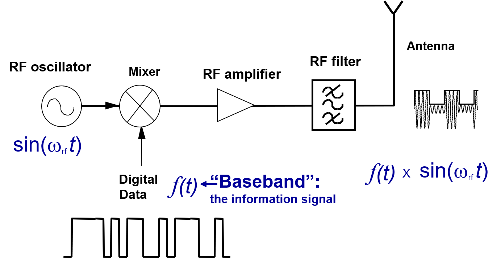
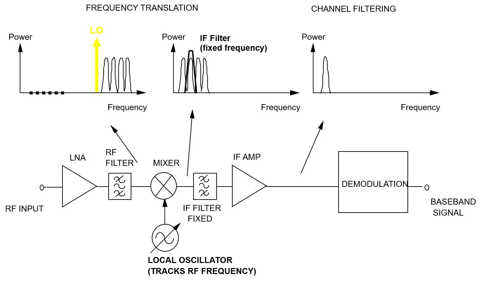
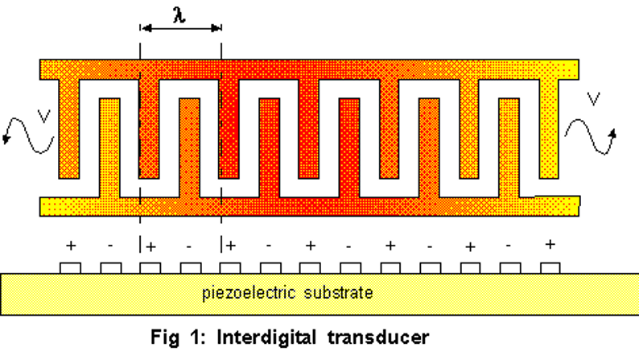
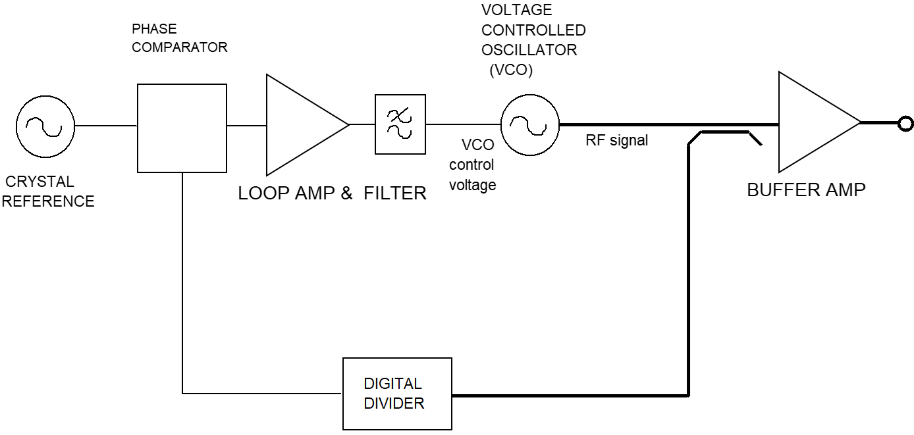
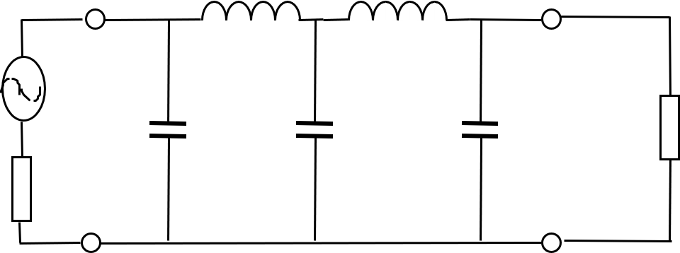
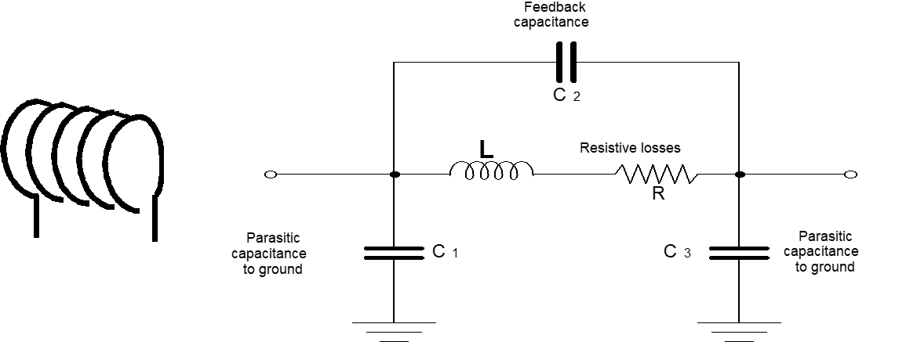

# 
XJEL/ELEC2140 Learning Tracking

## 
Yanshan Xie 201199596 2017110397

### 
Timestamp: April 17th, 2020

You can receive latest update here: [XJEL2140 Learning Tracking](./XJEL2140_Contents.html)

As the Lecture Captures are my major learning material right now, following table are filled.

| Source / Materials | Current Progress | Feedback & Note |
|:-|:-|:-|:-|
| Lecture Captures (Videos host on Mediasite) |OO_Mobile Phone and RFIC | **No nonplus so far** |
| Lecture Slides | *In sync with lecture captures* | **No nonplus so far** |
| ADS Screencast Tutorials for CAD Sheets | Cad2p1 | **No nonplus so far** |
| PowerPoint Screencasts of the Lectures (in Learning Resources) | 8_Reflections, Standing Waves, Transmission Line Resonators | The Screencasts are not compulsory, and some contents are covered in Lecture Captures. ***Planned for Revision.*** |
| Lab | ***<u>Not started yet</u>*** | ***<u>Not pragmatic now</u>*** |

## Detailed Progress
### Lecture Captures (Videos host on Mediasite)
- [x] [AA_Introduction - applications](#1)
- [x] [BB_Lab summary](#2)
- [x] [CC_Transmitters-Receivers Part1](#3)
- [x] [DD_Transmitters-Receivers Part2 (image etc)](#4)
- [x] [EE_Filters Part 1 50ohms & Intro](#5)
- [x] [FF_Filters Part 2 Poles & Zeros, Butterworth/Chebyshev](#6)
- [x] [GG_Lumped element filter design method](#7)
- [x] [HH_Parasitics of lumped elements](#8)
- [x] [II_Introduction to transmission lines](#9)
- [x] [IX_Reflections and Transmission Line Resonators](#10)
- [x] JJ_Microstrip
- [x] KK_Amplifiers Part 1 - Matching and stability
- [x] LL_Amplifiers part2 - Noise and Distortion
- [x] MM_Transmission Line Theory
- [x] MN_Impedance transformation along a line and the Smith Chart
- [x] MO_LAST LECTURE_Impedance transformation along a line
- [x] NN_Satellite TV receiver
- [x] OO_Mobile Phone and RFIC
- [ ] PP_Measurements
- [ ] ZA_FIRST YEAR CIRCUITS REVISION
- [ ] ZB_FIRST YEAR COMMS REVISION

### PowerPoint Screencasts of the Lectures (in Learning Resources)

- [x] 1_Satellite TV and LNBs.mp4
- [x] 2_SMITH CHART PROGRAMME DEMO.wmv
- [x] 3_TheBigFilterMovie.wmv
- [x] 3_filtermoviemp4_720p.mp4
- [x] 4_Transmitters and receivers part1 EvenBiggerReceiversMovie.mp4
- [x] 5_Image problem and digital multiplexes.mp4
- [x] 6_Parasitics in Ls and Cs.mp4
- [x] 7_Transmission line types.mp4
- [x] 8_Reflections, Standing Waves, Transmission Line Resonators.mp4
- [ ] 9_Amplifier design video.mp4
- [ ] 10_Transmission Line Resonators - filters.mp4
- [ ] 11_Transmission line theory & standing waves.mp4
- [ ] 12_TRL_parameters.mp4
- [ ] 13_Digital communications I and Q in transceivers.mp4

***

&nbsp;  
&nbsp;  
<h2 id="1"></h2>

# Note of *Introduction*
> ### *Relevent Materials:*
> 1d_Intro_done.ppt  
> AA_Introduction - applications

Worksheets x 3
* RF Circuit Design & Simulation

Examples x 2
* Mobile Phone
* Satelite TV

Labs x 3
* Filters & Resonators
* Receivers
* Transmission Lines

## Antenna
- Dishes
- Terrestrial (UHF)
- Sector
- Radar
  - Pulsed Radar &rArr; Distance
  - Doppler Radar &rArr; Speed!
- Adaptive Phased Array (Electronically Steered)
  - Beam Forming Network
  - &rArr; Virtual Phased Array (Synthetic Aperture) &nbsp; **Using Motion**

## Antenna Gain
Omnidirectional = *isotropic*

To steer the wave, use *bulb & parabollic reflector*

The Unit:

dBi

> `i` refers to *isotropic*  
> $$G(dBi)=10 \log (\eta \frac{\pi^2 D^2}{\lambda^2})$$

&nbsp;  
&nbsp;  
<h2 id="2"></h2>

# Note of *Lab Summary*

> ### *Relevent Materials:*
> 2_Lab_intro.pptx  
> BB_Lab summary

## Lab
1. LCR Filters
2. LC Resonator & CAD1
3. Superheterodyne(***`adj. 超外差的`***) receiver
    * Mixing
    * Picking up weak signals (recover)
4. Pulses on long transmission lines
    > [!IMPORTANT]
    > Reflections
5. Transmission lines as resonators

> **Microwaves:**  
> Waves guided by metal conductors.  
> e.g. Coaxial cables; Hollow waveguides; Microstrips

## Keysight Agilent ADS
* Circuit simulations
  * Frequency domain linear analysis
  * S-parameters
* Microstrip circuit simulations
  * Multi layer boards
* Frequency domain nonlinear analysis
  * Mixing (Multiplying)
* Electromagnetic simulations
* System level analysis
  * MIMO
  * LTE
  
## Key to this module
1. Transmission Lines
2. Frequency Domain
3. S-Parameters
   

> Standard 50Ohms: Characteristic impedances of cables

&nbsp;  
&nbsp;  
<h2 id="3"></h2>

# Note of *Transmitters&Receivers Part 1*
> ### *Relevent Materials:*
> 5_radioTXRX_part1_done.ppt  
> CC_Transmitters-Receivers Part1

## Basic Digital Transmitter

## AM Radio Receiver (Demodulation)

## Sharpness (Selectivity)
depends on losses in the L and C, **Particularly RL**.  

To represent the selectivity, Q is introduced.  

$$Q_{factor}=\frac{Fr}{3dB BandWidth}$$  

Bandwitdh increases proportional to the frequency it is tuned to **squared**.  
(i.e. **BandWidth&uarr;; Q&darr;**)  

## Mixing
is the frequency **translation** to a low frequency for processing.

 > ## [Prosthaphaeresis 和差化积 (from the Greek προσθαφαίρεσις)](https://en.wikipedia.org/wiki/Prosthaphaeresis)  
 > $$ cosA \times cosB = \frac{1}{2} cos(A-B) + \frac{1}{2} cos(A+B)$$

Thus, in frequency domain, the frequency components are changed into:

## Superheterodyne Receiver

Terms:
 - LO : Local Oscillator
 - IF : Intermediate Frequency
 - RF : Radio Frequency
 - LNA : Low Noise Amplifier
 - AMP : Amplifier

Tunning/Changing Channel can be accomplished by tunning **the frequency of Local Oscillator**.

In order to achieve sharp frequency response, IF Filter is a bandpass filter that have **fixed** parameters.

**The LO must be very stable in frequency, and tune-able.**
Thus, some frequency sources introduced.

## SAW Devices (Surface Acoustic Wave)

## Also the Crystal Oscillator
Piezoelectric Material 压电材料  
Quartz 石英

## PLL (Phase Lock Loop)
The Oscillators above are very stable but relatively low frequency.
PLL can be used as **Clock Multipliers**.

> Phase Comparator  
> knows *almost instantly* when the frequency is drifting out.

Tune the frequency can be easily achieved by changing the factor of **digital divider**.

&nbsp;  
&nbsp;  
<h2 id="4"></h2>

# Note of *Transmitters&Receivers Part 2*
> ### *Relevent Materials:*
> 6_radioTXRX_part2_done.ppt  
> DD_Transmitters-Receivers Part2 (image etc)

## Image Problem

### Negative Frequency
Any signal at 88 MHz will also mix down to 1 MHz and pass through the IF filter.

To releviate the problem, a RF filter is introduced before the mixer (**Image Filter**).

## Double Conversion Receiver

## Key Points
  - Fractional Bandwidth (i.e. frequency&uarr;;Bandwidth&darr;)
  - Mixing : Sum and Difference frequencies
  - [Superheterodyne Diagram](#superheterodyne-receiver) & Operation
  - Tunning Local Oscillator (Quartz Reference) to select

## Digital Data Sidelobes
The sharp digital data need **infinite high frequency** to recover.

To limit the bandwidth, filters used.

- Still only interested in "1" or "0" level, so noise is rejected
- Sharp corners are rounded to limit the RF signal to a small bandwidth
- Filters, often use DSP chips

## Phase Modulation

Using the phase to represent "1" and "0" means the modulated signal uses less bandwidth for a certain data rate.

- Used in high quality digital links
- Less sensitive to noise
- Better *spectral efficiency* (bits/secend/Hz)
  
### Quaternary Phase Shift Keying (QPSK)
4 phases states: 0&deg; 90&deg; 180&deg; 270&deg;  

Transmitter used in phone system:

### 16-QAM (Quadrature Amplitude Modulation)
The Constellation (调制星座图):

## But Higher bits/symbol &Rarr; Lower resistance to noise!!!

## Software Radio
AD or DA chips can not directly placed at the antenna!
To be realistic, AD or DA are operating at Intermediate Frequency or Baseband.
This gives AD/DA conversion much **higher dynamic range** and much **less demanding specifications**

## Direct Conversion Architectures (homodyne 零差)
Carrier Frequency = Frequency of Local Oscillator (receiver)

Pros:
- Digital Circuits *directly applied* to baseband signals
- Lower component count and cost
- Flexibility
  - Different data rates; modulation schemes; services; future upgradation

Cons:
- Higher DC power

&nbsp;  
&nbsp;  
<h2 id="5"></h2>

# Note of *RF Filters Part 1*
> ### *Relevent Materials:*
> 8_FILTS_part1_50Ohms_done.ppt  
> EE_Filters Part 1 50ohms & Intro

> ## A transducer for separating waves on the basis of their frequencies.

## Transmission Lines

- Low loss
- Shield
  - Preventing signal leaking
  - Rejecting electrical interference
- The signal is confined (***GUIDED***) by conductors  
- ## 
Waves

### eg: Coaxial Cable (同轴线缆)

## Impedance Match

Unless the amplifiers are matched to the characteristic impedance (**50 &Omega;**) of the cables and conntectors;

**Reflections** are created between components.

## S-Parameters
> [**Scattering parameters** or **S-parameters**](https://en.wikipedia.org/wiki/Scattering_parameters) (the elements of a scattering matrix or S-matrix) describe the electrical behavior of linear electrical networks when undergoing various steady state stimuli by electrical signals.  
> S-parameters are mostly used for networks operating at radio frequency (RF) and microwave frequencies where signal power and energy considerations are more easily quantified than currents and voltages.  
> An example: The S-parameter matrix for the 2-port network

>   
> $$\begin{pmatrix} b_1 \\ b_2 \end{pmatrix}\ = \begin{pmatrix} S_{11} & S_{12} \\ S_{21} & S_{22} \end{pmatrix}\ \begin{pmatrix} a_1 \\ a_2 \end{pmatrix}$$  
>   
> $$S_{11}$$ is the input port voltage reflection coefficient  
> $$S_{12}$$ is the reverse voltage gain  
> $$S_{21}$$ is the forward voltage gain  
> $$S_{22}$$ is the output port voltage reflection coffeicient  

#### **S-parameters change with the measurement frequency**, 
so frequency must be specified for any S-parameter measurements stated, in addition to the characteristic impedance or system impedance.
## Practical L-C Filter Design (Lowpass)

Power in dB: $$ 10 \log(A) $$  
$$ P = \frac{U^2}{R} $$  
Voltage in dB: $$ 20 \log(A) $$  

&darr;

Gain in dB: $$ 20 \log\vert S_{21}\vert $$  
Return in dB: $$ 20 \log\vert S_{11}\vert $$  

### Particularly for **losses passive network**:

$$ {\vert S_{21}\vert}^2 + {\vert S_{11}\vert}^2 = 1 $$

## dBm
分贝毫瓦 decibel relative to one milliwatt, is an absolute value! not relative!  

$$ P(mW) = (1 mW) 10^{x/10}$$  

$$ x(dBm) = 10\log(P/(1mW))$$

$$ 1\quad Watt = 30\quad dBm $$

## Filter Types
- Ideal Lowpass Filter (brickwall filter) **Cannot be obtained**
- Butterworth (Maximally Flat)
  - $$ \vert H(j\omega)\vert = \frac{1}{\sqrt{1+(\frac{\omega}{\omega_0})^{2n}}} $$
- Chebyshev (ripples in passband)

&nbsp;  
&nbsp;  
<h2 id="6"></h2>

# Note of *RF Filters Part 2*
> ### *Relevent Materials:*
> 9_FILTS_part2_lumped_done.ppt  
> FF_Filters Part 2 Poles & Zeros, Butterworth/Chebyshev

## Transfer Function

A simple example of Lowpass RC filter
 
$$ V_{out}=\frac{1/j\omega C}{R+1/j\omega C}V_{in} =  \frac{1}{1+j\omega CR}V_{in} $$

$$ H(s)=\frac{1/sC}{R+1/sC}= \frac{1}{1+sCR} $$

## s-Domain
Wider range: step,impulse.sinusoid...  
$$ s=\sigma +j \omega $$

## Impulse Response

Impulse Signal: $$\delta(t)\qquad \mathcal{L}[\delta(t)]=1 $$

$$ r(t)=\mathcal{L}^{-1}[1\times H(s)] $$

## Poles and Zeros

$$ H(s) = \frac{N(s)}{D(s)} = \frac{a_{p}s^{p}+a_{p-1}s^{p-1}+...+a_{1}s+a_{0}}{b_{q}s^{q}+b_{q-1}s^{q-1}+...+b_{1}s+b_{0}} $$  

$$ = K \times \frac{(s+z_1)(s+z_2)...(s+z_n)}{(s+p_1)(s+p_2)...(s+p_n)} $$

> $$ N(s) $$ and $$ D(s) $$ stand for the numerator and the denominator.

Note that the poles and zeros are all in the complex s-domain.

## Bode Plots
> The **Bode Plot** is graphical technique for represeting transfer functions (both magnitude and phase) versus frequency.

Note that each pole and zero can be *approximated by a straight line* when plotted on a log-log scale.  
Each pole and zero is hence represented by a straight line with slope "**20dB per decade**" (either upwards or downwards).

## Why "Brickwall" Filter is impossible
> [Causal Filter 因果滤波器](https://en.wikipedia.org/wiki/Causal_filter) is a linear and time-invariant causal system (线性时不变且因果的系统). The word causal indicates that the filter output depends only on past and present inputs.  
> A filter whose output also depends on future inputs is **non-causal**, whereas a filter whose output depends only on future inputs is anti-causal(反因果的).  
> Systems (including filters) that are realizable (i.e. that operate in real time) **must be causal** because such systems cannot act on a future input.

Because (in 'brickwall' case) the impulse response is found to have a signal at the output **BEFORE** the impulse function has been applied to the input.

The impulse response:

## Approximations
In reality, we may only approximate the ideal characteristics within a certain prescribed error.

### 3 main filter types
1. Butterworth (Maximally Flat)
2. Chebyshev (Equi-ripple)
   - Sharper transition between the passband and the stopband
   - equi-ripple in the passband
3. Elliptic
   - equi-ripple in both the passband and the stopband

For Butterworth:

$$ H(s) = \frac{1}{1+s^n} \text{where n is the order.}$$

$$ \vert H(j\omega)\vert = \frac{1}{\sqrt{1+(\omega)^{2n}}} $$

Poles diagrams at 3rd and 4th order:

## Practical L-C Filter Design

- Lowpass
  - 
- Highpass
  - 
- Bandpass (use effects of Resonator)
  - 
- Bandstop (use effects of Resonator)
  - 

&nbsp;  
&nbsp;  
<h2 id="7"></h2>

# Note of *Lumped Element Filter Design Method*
> ### *Relevent Materials:*
> 10_filterdesignmethod_done.ppt  
> GG_Lumped element filter design method

## Keysight Function Generator
In 50&ohm; impedance mode:  
- 50&ohm; Source
- Output *V*  
- 50&ohm; Load
- ### Thus *V/2* at terminals

High-Z mode (Connect Oscilloscope probes):  
- 50&ohm; Source  
- Output *V*  
- High-Z (impedance) Load
- ### Thus *V* at terminals

<h2 style="color:#3F51B5;">Design Procedure</h2>

1. 
Choose Filter Order and Type (选型)

2. 
Read off 'prototype' values (查表)

3. 
Transform the network (转换电路 excluded LP)

4. 
Denomalize (去标准化)

<h2 style="color:#C2185B;">IMPORTANT Keys x 3:</h2>

1. $$\omega = 2\pi f$$
2. $$\omega = 2\pi f$$
3. $$\omega = 2\pi f$$
4. For Highpass, Bandpass, Bandstop filters, the network **MUST** be transformed **BEFORE** denormalizing
5. For Highpass, Bandpass, Bandstop filters, the network **MUST** be transformed **BEFORE** denormalizing
6. For Highpass, Bandpass, Bandstop filters, the network **MUST** be transformed **BEFORE** denormalizing

## 'Prototype' Filter

Start with a lowpass filter which realises the required Butterworth/Chebyshev transfer function.

The component values are normalized to
- an angular frequency of 1 rad/s
- impedance of 1 Ω

## Denormalize
For Highpass, Bandpass, Bandstop filters, the network **MUST** be transformed **BEFORE** denormalizing

$$ L_k = \frac{\text{normalized value}_k \times R}{\omega_c} $$  

$$ C_k = \frac{\text{normalized value}_k }{\omega_c \times R} $$

<h2 style="color:#ffb300;">Example 1: An simple Lowpass filter</h2>

- 3rd order (n=3)
- Butterworth
- Lowpass filter
- for 50Ω system
- fcut-off=10MHz
- use a series element first

1. General 3rd order lowpass prototype filter
    - 
2. Read off normalized values
    - 
    - then, Fill the values (g)
    - 
3. <text style="color:#ef5350;">Transfer networks (not needed for Lowpass filter)</text>
4. Denomalize
    - $$ L_1 = \frac{\text{normalized value}_1 \times R}{\omega_c}\\ = \frac{1\times 50}{2\pi\times10\times10^6}H=796nH$$ 
    - $$ C_2 = \frac{\text{normalized value}_2 }{\omega_c \times R}\\ = \frac{2}{2\pi\times10\times10^6\times R}F=637pF $$

## Lowpass ↠ Highpass/Bandpass/Bandstop Transformation

|Lowpass ↠|Highpass|Bandpass|Bandstop|
|:---------:|:---------:|:---------:|:---------:|
|$$\omega$$|$$\frac{1}{\omega}$$|$$\frac{1}{\Delta}(\frac{\omega}{\omega_o}-\frac{\omega_o}{\omega})$$|$$\frac{\Delta}{(\frac{\omega}{\omega_o}-\frac{\omega_o}{\omega})}$$|
|||||
|Origin|Mirror Image|DC Shift Up|Mirror Image + DC Shift Up|
|Original LOWPASS Element|HIGHPASS Element|BANDPASS Element|BANDSTOP Element|
|$$j\omega L$$|$$\frac{1}{j\omega C}$$|         |         |
| $$ g_k $$| $$ \frac{1}{g_k} $$| $$ L:\frac{g_k}{\Delta}\quad C:\frac{\Delta}{g_k}$$| $$ L:{g_k}{\Delta}\quad C:\frac{1}{g_k \Delta}$$|
| $$ g_k $$| $$ \frac{1}{g_k} $$| $$ L:\frac{\Delta}{g_k}\quad C:\frac{g_k}{\Delta}$$| $$ L:\frac{1}{g_k \Delta}\quad C:{g_k}{\Delta}$$|

where the **fractional bandwidth**:

$$\Delta=\frac{\omega_2-\omega_1}{\omega_o}$$

the **geometric mean / center frequency**:

$$\omega_o=\sqrt{\omega_1 \omega_2}$$

<h2 style="color:#ffb300;">Example 2: An simple bandpass filter</h2>

- 3rd order (n=3)
- Butterworth
- Bandpass L-C lumped element filter
- for 50Ω system
- with a passband between 450kHz and 460kHz
- use a series element first

1. General 3rd order **LOWPASS** prototype filter
    - 
2. Read off normalized values
    - 
    - then, Fill the values (g)
3. <text style="color:#ef5350; font-size:16pt;">Transfer networks</text>
    - 
    - $$\omega_o=\sqrt{\omega_1 \omega_2} = 2\pi\sqrt{\omega_1 \omega_2} = 2858677 rad/s$$
    - $$\Delta=\frac{\omega_2-\omega_1}{\omega_o} = \frac{2\pi(\omega_2 - \omega_1)}{2858677} = 0.02198$$
    - 
4. Denomalize
    - $$ L_1 = \frac{\text{normalized value}_1 \times R}{\omega_c}\\ = \frac{45.5\times 50}{2858677}H = 796\mu H$$ 
    - $$ C_1 = \frac{\text{normalized value}_1 }{\omega_c \times R}\\ = \frac{0.02198}{2858677 \times 50}F=154pF $$
   -  $$ L_2 = \frac{\text{normalized value}_2 \times R}{\omega_c}\\ = \frac{0.01099\times 50}{2858677}H = 192nH$$ 
    - $$ C_2 = \frac{\text{normalized value}_2 }{\omega_c \times R}\\ = \frac{91}{2858677 \times 50}F=637nF $$

&nbsp;  
&nbsp;  
<h2 id="8"></h2>

# Note of *Parasitics of Practical Lumped Elements*
> ### *Relevent Materials:*
> 11_LC_Parasitics_done.ppt  
> HH_Parasitics of lumped elements

# Parasitics of Capacitor

# Parasitics of Inductor

<h2 style="color:#ffb300;">What stops you making a higher and higher order filter that approaches the “brick wall” filter?</h2>
Every L/C component has a self-resonant frequency, beyond which its behaviour is erratic.

- Increased loss in the passband
- Reduced rejection in the stop band
- Reduced “sharpness” of transitions
- Spurious (adj. 假的；伪造的；欺骗的) behaviour at high frequency
- Shifts in the cut-off or centre frequency

&nbsp;  
&nbsp;  
<h2 id="9"></h2>

# Note of *Transmission Lines Introduction*
> ### *Relevent Materials:*
> 12_TRLs_intro.ppt  
> II_Introduction to transmission lines

## Analogy: Organ pipes
Speed of Wave: $$V=f\lambda$$

## Coaxial Lines

Fields IMG!

### Characteristic Impedance: 
$$ Z_o=\sqrt{\frac{L}{C}}=\frac{377}{2\pi \sqrt{\varepsilon_r}}\ln(\frac{b}{a})\\
\text{where: C is capacitance per unit length}\\
\text{L is Inductance per unit length}$$

### Features
- Useable up to 110GHz, depending on type
- Ideal for **wideband** compontents *(pure TEM field)*
- Used in measurement equipment

> **Micro Coax** for high speed digital data transmission.

## Microstrip
> Transmission line on PCB  
> but for high frequencies, special 'PCB' materials are needed

IMG!

> microstrips are open circuit on both sides;  
> Length of a microstrip: $$ \lambda_g /2$$

### Features
- **Losses are quite high** giving moderate performance
- Useable up to 100GHz with suitable material
- Fabricated with photomasks (PCB-Like etching), cheap and easy to make
- Can solder on components
- Can make filters and matching networks simply by 'drawing' them
- The Ground plane takes care of itself

### Field Pattern
Since the structure is **not symmetrical**, the field pattern is not simple like coax.

IMG!!!

### L-C Equivalence: make filters and matching networks

IMG!!!  

The design of more advanced micostrip circuits (e.g. amplifilers) requires an understanding of
<h3 style="color:#ef5350;">distributed circuits</h3>

## Twisted Pairs(双绞线) & Lecher Line(勒谢尔线)
> [Twisted pair cabling](https://en.wikipedia.org/wiki/Twisted_pair) is a type of wiring in which two conductors of a single circuit are twisted together for the purposes of **improving electromagnetic compatibility**. Compared to a single conductor or an untwisted balanced pair, a twisted pair **reduces electromagnetic radiation from the pair and crosstalk between neighboring pairs and improves rejection of external electromagnetic interference**. It was invented by Alexander Graham Bell.

> In electronics, a [Lecher line or Lecher wires](https://en.wikipedia.org/wiki/Lecher_line) is a **pair of parallel wires or rods** that were used to **measure the wavelength of radio waves**, mainly at UHF and microwave frequencies. They form a short length of balanced transmission line (a resonant stub). When attached to a source of radio-frequency power such as a radio transmitter, the radio waves form standing waves along their length.  
> Commercially available **300 and 450 ohm** twin lead balanced ribbon(n. 带；缎带；带状物；) feeder can be used as a fixed length Lecher line (resonant stub).

IMG!!!

### Features
- Minimal confinement
- Lower frequencies only

## Hollow Waveguide [(空腔波导管)](https://en.wikipedia.org/wiki/Waveguide_(radio_frequency))

IMG!!!

### Features
- **Low loss, high power**
- Useable from about 1GHz to 325GHz
- Complex non-TEM fields

### Rectangular Waveguide (Particular Case)
Single Metal Pipe;  
Can not transmit DC as there is no return path for current
Cut-off frequency: when the width is a half wavelength

IMG!!!

> The electromagnetic waves in a (metal-pipe) waveguide may be imagined as travelling down the guide in a zig-zag path, being repeatedly reflected between opposite walls of the guide. For the particular case of rectangular waveguide, it is possible to base an exact analysis on this view. Propagation in a dielectric waveguide may be viewed in the same way, with the waves confined to the dielectric by total internal reflection at its surface.

#### Analogy: Optical Fibre: Based on total internal reflection.

IMG!!!

The complex field pattern is the sum of a pair of waves, each reflecting off the matellic walls at the critical angle.

IMG!!! IMG TE10!!!

### Frequency bands
A range of standard waveguide sizes is used to cover the whole microwave and millimetre-wave spectrum.

&nbsp;  
&nbsp;  
<h2 id="10"></h2>

# Note of *Transmission Lines Filters*
> ### *Relevent Materials:*
> 13_TRLs_filters.ppt  
> IX_Reflections and Transmission Line Resonators

## Analogy: Organ Pipe (Resonator)
Acoustic Wave: 400Hz in ~200mm  
Electromagnetic Wave: 375000000Hz in ~200mm  
**Difference is speed of waves propagation**

## Analogy: String & Trombone Tuner & Trumpet
Standing waves.

## Analogy: Pendulum
Potential Energy &harr; Kinetic Energy  
&Rarr; Simple harmonic motion
> Mechanical Vibration: Quartz Crystal Oscillator

## LC Resonator
Energy stored in magnetic field (Inductor)  

&harr;
  
Energy stored in electric field (Capacitor)

$$fr = \frac{1}{2\pi \sqrt{LC}}$$

Parallel LC = open circuit at resonance  
Series LC = short circuit at resonance

*Loading Effect*

## Reflections in Trans-Line Resonators
Energies are stored in L/C. Energy does not disappear. When reach the 'terminals', it propagate back(REFLECTION).

Reflection Coefficient: $$ \Gamma $$

### 3 Special Cases

|Open Circuit|Short Circuit|LOAD = $$Z_o$$|
|---------|---------|---------|
|CIRCUIT IMG!!!|CIRCUIT IMG!!!|CIRCUIT IMG!!!|
|$$ \Gamma = +1$$|$$ \Gamma = -1$$|$$ \Gamma = 0$$|
|mag 1, phase 0 degrees|mag 1, phase 180 degrees|mag 0, phase 0 degrees|
|voltage waves|voltage waves|nothing reflected, a *matched* load|
|IMG|IMG|IMG|

### General Case
CIRCUIT IMG!!!

Reflection Coefficient:  

$$ \Gamma = \frac{\text{reflected}}{\text{incident}}=\frac{Z_L - Z_o}{Z_L + Z_o}$$

## Transmission Line Resonators

### Analogy: Organ Pipe
IMG!!!

### (Open/Short) Quarter-Wavelength Resonator
- One end **open circuit**
- The other end **short circuit**

CIRCUIT IMG!!!

IMG!!!

> e.g. Combline Filter(梳状线 滤波器): Mechanical Resonators, Adjust Gaps

Blow too hard and you get harmonics.

$$3\times \frac{\lambda_g}{4}$$

IMG!!! WITH FREQUENCY with lumpped

Lumped elements are unpredictable at High Frequencies.  
Transmission Lines are predictable; Harmonics can be suppressed.

### Analogy: Waveguide Cavity & Glass Bottle
IMG!!!
### (Short/Short) Half-Wavelength Resonator
- **BOTH** ends are **short circuit**

IMG!!!

### (Open/Open) Half-Wavelength Resonator

MOST COMMONLY USED in microstrips.

- **BOTH** ends are **open circuit**

IMG!!!

### Microstrip Resonators

IMG!!!

Multiple Resonators coupled together give the desired Bandpass response:  
But it is subtler than this implies because **the resonators load each other**

- In all cases, the signal is coupled in and out through somthing like a hole in a ground plane, or a gap between signal conductors
- It is important that the LOADED Q si not lowered too much by overcoupling
- Ultimately, the loss in the transmission line determines the highest Q-factor that can be achieved

!!!THREE IMGS!!!

### Dimensions of Resonators

$$v=f\times \lambda =\frac{c}{\sqrt{\varepsilon_r}}\\ \text{where the }\varepsilon_r\text{is the dielectric constant of microstrip material}$$

Thus, to make a resonator small for given frequency, you need a low velocity.  
This means a high dielectric constant material is required.
i.e. $\quad\lambda\downarrow;v\downarrow;\varepsilon_r\uparrow$

#### Example

- Calculate the physical length of a quarter-wavelength coax resonator designed for 
  - a) 10 GHz
  - b) 10 MHz
- with $\varepsilon_r=10\quad c=3\times10^8 m/s$

Solution:
- $v=\frac{c}{\sqrt{\varepsilon_r}}=9.4868E+07$
  - a) $\lambda=v/f=0.00949 \\ \text{Physical length}=\lambda/4=0.00237 m$
  - b) $\lambda=v/f=9.48683 \\ \text{Physical length}=\lambda/4=2.3717 m$

## TEM Mode Dielectric Combline
- Compact Size
- Low Loss
- Surface Mount
- Low Cost
  - These filters consist of short circuited stub resonators dielectrically loaded to reduce their size.
  - TEM dielectric resonators can be coupled to produce miniature bandpass or bandreject filters which are much smaller than cavity filters and have lower loss than lumped element or microstrip filters.

> [TEM(Transverse electromagnetic mode)](https://en.wikipedia.org/wiki/Waveguide_filter#Modes), a transmission mode where all the electric field and all the magnetic field are perpendicular to the direction of travel of the electromagnetic wave. This is the usual mode of transmission in pairs of conductors.

## [Waveguide modes(EXTRA CONTENT)](https://en.wikipedia.org/wiki/Transverse_mode)

Modes in waveguides can be further classified as follows:
1. Transverse electromagnetic (TEM) modes
   - Neither electric nor magnetic field in the direction of propagation.
2. Transverse electric (TE) modes
   - No electric field in the direction of propagation. These are sometimes called H modes because there is only a magnetic field along the direction of propagation (H is the conventional symbol for magnetic field).
3. Transverse magnetic (TM) modes
   - No magnetic field in the direction of propagation. These are sometimes called E modes because there is only an electric field along the direction of propagation.
4. Hybrid modes
   - Non-zero electric and magnetic fields in the direction of propagation.

**Hollow metallic waveguides** filled with a homogeneous, isotropic material (usually air) support TE and TM modes but not the TEM mode.

In **coaxial cable** energy is normally transported in the fundamental TEM mode.  
The TEM mode is also usually assumed for most other electrical conductor line formats as well. This is mostly an accurate assumption, but a major exception is:

**MICROSTRIP** which has a significant longitudinal component to the propagated wave due to the inhomogeneity at the boundary of the dielectric substrate below the conductor and the air above it.

In an **optical fiber** or other dielectric waveguide, modes are generally of the hybrid type.

In rectangular waveguides, rectangular mode numbers are designated by two suffix numbers attached to the mode type, such as TEmn or TMmn, where *m* is the number of half-wave patterns across the width of the waveguide and *n* is the number of half-wave patterns across the height of the waveguide.  
In circular waveguides, circular modes exist and here *m* is the number of full-wave patterns along the circumference and *n* is the number of half-wave patterns along the diameter.

---

TODO: Add more notes
