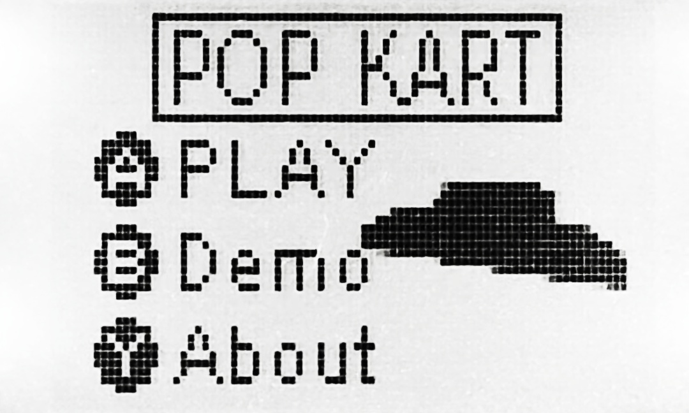

# POP KART Instructions (Wiki)

> This is a simple obstacle avoidance game, based on MCU K64F.  
> To experience the game, you should connect your [FRDM-K64F](https://os.mbed.com/platforms/FRDM-K64F/) board to a **Gamepad (Version 1)** which is designed by the University of Leeds.

<a style="color:#267CB9;font-size: 18pt;" href="./el17yx.bin">DOWNLOAD compiled BIN firmware</a>

---

## 
Author:  Yanshan Xie

15th May 2020

&nbsp;

### E-mail: el17yx@leeds.ac.uk
### GitHub: [https://github.com/XYSheldon/](https://github.com/XYSheldon/)
### LinkedIn: [https://www.linkedin.com/in/yanshan-xie/](https://www.linkedin.com/in/yanshan-xie/)
### Code Page: [https://os.mbed.com/teams/XJEL2645-1920/code/el17yx/](https://os.mbed.com/teams/XJEL2645-1920/code/el17yx/)

Dependencies:
- [https://os.mbed.com/users/mbed_official/code/mbed/](https://os.mbed.com/users/mbed_official/code/mbed/)
- [https://os.mbed.com/users/eencae/code/Gamepad/](https://os.mbed.com/users/eencae/code/Gamepad/)
- [https://os.mbed.com/users/eencae/code/N5110/](https://os.mbed.com/users/eencae/code/N5110/)

## Development of 3D Engine on MCU

### An original **3D Rendering Engine** named `xysGL` is developed to support the graphics. 

`xys` is the abbreviation of my Chinese name, and `GL` pays tribute to the famous 3D Engine `OpenGL`. To achieve a good graphic performance, few classes/functions are developed:

- `glCore` : Core functions for rendering
- `glModel` : Models related classes and functions
- `glMath` : Math Library about Linear Algebra (Vectors and Matrix)
- `glPhys` : Physics Library to simulate motion

Check [API Documentation](https://os.mbed.com/teams/XJEL2645-1920/code/el17yx/docs/tip/) for detailed information.

## References
- Documentations of Microsoft Direct3D helped me a lot about understanding computer graphics. Source: [https://docs.microsoft.com/en-gb/windows/win32/direct3d9/dx9-graphics](https://docs.microsoft.com/en-gb/windows/win32/direct3d9/dx9-graphics)

- 2 pieces of music which were built-in of the NEXON's game are included in this game. Source: [https://www.nexon.com/main/en](https://www.nexon.com/main/en)

# Get Started
## MENU
After booting, a MENU should appear on the N5110 LCD.

You (the gamer) will notice a Kart is rotating on the LCD screen, which is the Kart you will drive.

**Controls:**

- Button `A` - Launch the GAME.
- Button `B` - Launch the DEMO, which is a game that obstacles removed.
- Button `Y` - Show ABOUT information
- Rotate `Potentiometer` to adjust **Contrast** of the LCD

## GAME
This is a simple game. You (the gamer) are asked to drive a Kart on a straight and infinitely long road which has random obstacles.

To avoid crashing, you will need to adjust the heading of the Kart using the Joystick on the board.

To simplify this process, **only x-axis will take into account**, which means you do not need to control the vanward speed of the Kart.

As the distance increased, the number and density of obstacles will increase.

Your Score (the distance of driving) is shown on the LCD screen's top left corner instantaneously.

**Controls:**

- x-axis of `Joystick` - Steering the Kart
- Button `START` - Pause/Resume the GAME
- Button `X` - Back to MENU **when GAME paused/ after GAMEOVER**
- Rotate `Potentiometer` to adjust **Contrast** of the LCD

--- 

# 
HAVE A GOOD TRIP~

---

## DEMO

This is a DEMO to show the graphics engine which is basically a no obstacles game with faster driving velocity.

In this mode, there are no obstacles. You can drive the Kart freely on the high-speed straight road.

**Controls:**
- x-axis of `Joystick` - Steering the Kart
- Button `START` - Pause/Resume the DEMO
- Button `X` - Back to MENU **when DEMO paused**
- Rotate `Potentiometer` to adjust **Contrast** of the LCD

## ABOUT
This is a page to show some message I left. A QR Code is included.

**Controls:**

- Button `X` - Back to MENU
- Rotate `Potentiometer` to adjust Contrast of the LCD

# Gaming Tips
- The Kart is simulated by Newton's Law, to avoid crashing, you must predict the trace of the Kart.
