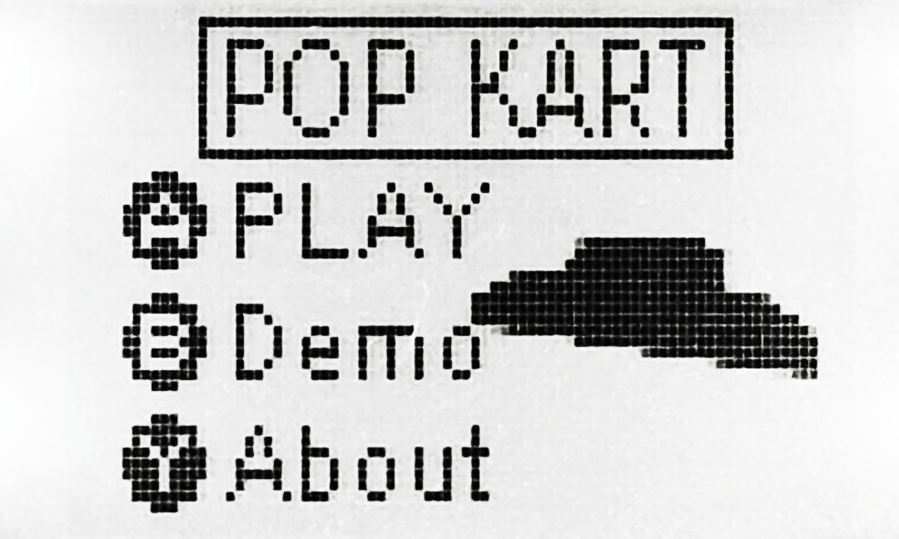

# Gaming!

## [XJEL2645 Project: PopKart](./XJEL2645/XJEL2645_Wiki.html)
#### Click link above to experience my PopKart~

&nbsp;

# Learning
## [XJEL2140 Learning Tracking](./XJEL2140/XJEL2140_Contents.html)
#### Click link above to track my XJEL/ELEC2140 learning~~~
## [XJEL3662 Online Software Documentation](./XJEL3662/Online_Software_Documentation/index.html)

&nbsp;

# My Music~~~

<iframe frameborder="0" marginwidth="0" marginheight="0" width="90%" height="96" src="https://music.163.com/outchain/player?type=2&id=493564688&auto=0&height=66" allowfullscreen></iframe>

### [
Netease Musician Page
](https://music.163.com/#/artist?id=12094050)

&nbsp;

# About me

### [My Github Profile](https://github.com/XYSheldon)
### [My Linkedin Profile](https://www.linkedin.com/in/yanshan-xie/)

&nbsp;

# Demo Pages / Demo Docs
[Link to Demo Page (Default)](./demopage.html).
[Link to Demo Page (Post)](./demopost.html).